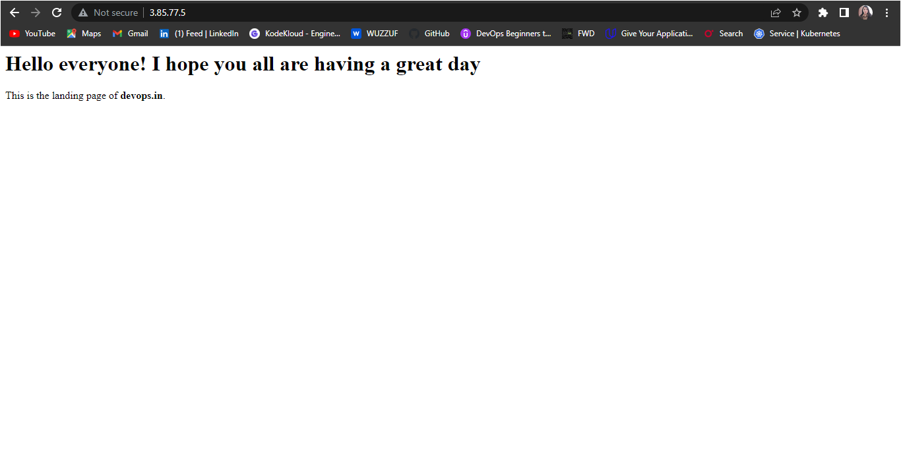
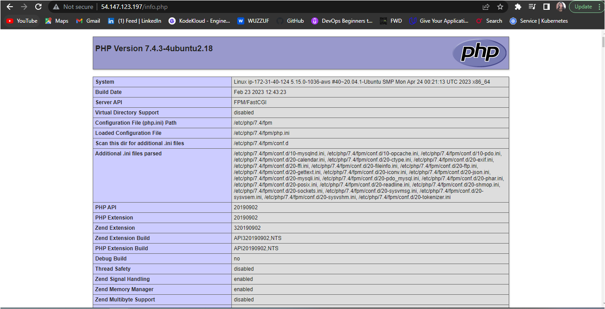
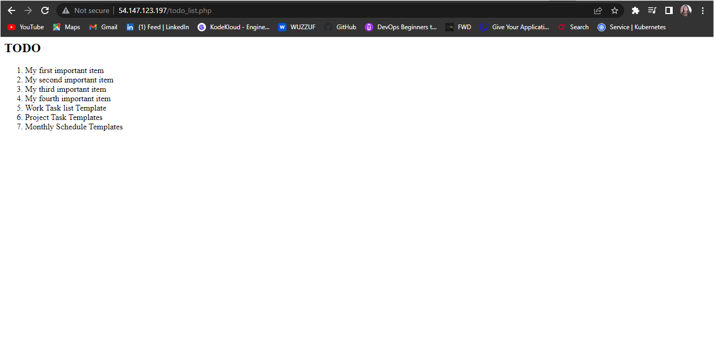

# Deploying-lempstack(Linux, Nginx, MySQL, PHP)-on-ubuntu 20.04, and take daily backup

## Step 1 – Installing the Nginx Web Server
sudo apt update

sudo apt install nginx

Go to your browser and type your IP addr or domain_name http://server_domain_or_IP

## Step 2 — Installing MySQL

#### Now that you have a web server up and running, you need to install the database system to be able to store and manage data for your site.

sudo apt install mysql-server

#### Start the interactive script by running:

sudo mysql_secure_installation

After entering your Password If it didn't work there're 2 solutions to do:
- First: enter this command to ensure that we pass the correct credentials when connecting to MySQL:

mysql -uhomer -pStrongPwd

- Second: Set the password for the root user:

ALTER USER 'root'@'localhost' IDENTIFIED BY 'StrongPwd';

Then test if you’re able to log in to the MySQL console:

sudo mysql

then exit after test

## Step 3 – Installing PHP
#### To install the php-fpm and php-mysql packages, run:

sudo apt install php-fpm php-mysql

## Step 4 — Configuring Nginx to Use the PHP Processor
1- Create the root web directory for your_domain as follows:

sudo mkdir /var/www/devops.in(my_domain)

2- Next, assign ownership of the directory

sudo chown -R $USER:$USER /var/www/devops.in

3- Then, open a new configuration file in Nginx’s sites-available directory

sudo vim /etc/nginx/sites-available/devops.in

4- Activate your configuration by linking to the config file from Nginx’s sites-enabled directory:

sudo ln -s /etc/nginx/sites-available/devops.in /etc/nginx/sites-enabled/

5- Then, unlink the default configuration file from the /sites-enabled/ directory:

sudo unlink /etc/nginx/sites-enabled/default

6- Test your configuration for syntax errors by typing:

sudo nginx -t

7- Reload Nginx to apply the changes:

sudo systemctl reload nginx

8- Create an index.html file in that location to test that your new server block works as expected:

nano /var/www/devops.in/index.html

9- Now go to your browser and access your server’s domain name or IP address:

http://server_domain_or_IP

## Step 5 –Testing PHP with Nginx
1- creating a test PHP file in your document root called info.php

vim /var/www/devops.in/info.php

2- You can now access this page in your web browser

http://server_domain_or_IP/info.php

## Step 6 — Testing Database Connection from PHP 

1- Connect to the MySQL console using the root account:

sudo mysql -uroot -p

CREATE DATABASE fawry_internship;

CREATE USER 'example_user'@'%' IDENTIFIED WITH mysql_native_password BY 'password';

GRANT ALL ON example_database.* TO 'example_user'@'%';

INSERT INTO fawry_internship.todo_list (content) VALUES ("My first important item");

#### To confirm that the data was successfully saved to your table, run:

SELECT * FROM fawry_internship.todo_list;

exit

#### Create the PHP script that will connect to MySQL and query for your content.

vim /var/www/devops.in/todo_list.php

#### now access this page in your web browser by visiting the domain name or public IP address, followed by /todo_list.php:

http://server_domain_or_IP/todo_list.php

## step 7 - Take daily Backup:

1- Write script for daily backup you'll find the script just Edit the configuration options at the beginning of the script to match your environment.

2- Make the script executable

chmod +x backup-mysql.sh

3- Run the script.

./backup-mysql.sh

4- Setup a cronjob to run the script daily/weekly if you choose.

5 1   * * * /etc/backup-mysql.sh >/dev/null 2>&1

