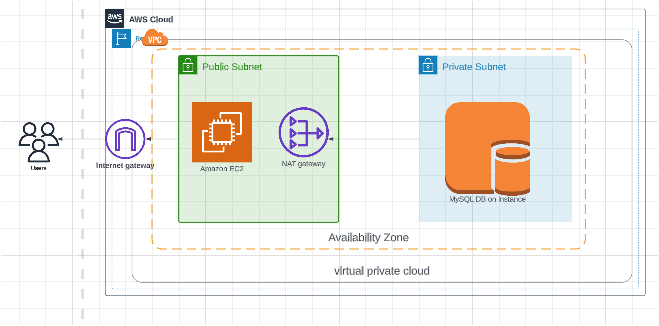

# LEMP stack on AWS:
LEMP Stack is a combination of four open-source technologies that are used in web development. These technologies include:

- Linux: The operating system that runs the web server.

- Nginx: The web server software that handles HTTP requests.

- MySQL: The relational database management system that stores the website’s data.

- PHP: The programming language used to build dynamic web applications.

## Why is the LEMP Stack popular in web development?

- High performance: Nginx is known for its high performance, making it an excellent choice for handling large amounts of traffic.
- Scalability: The LEMP stack is highly scalable, making it a good choice for websites that need to handle a large volume of traffic.
- Open-source: All of the components of the LEMP stack are open-source, making it cost-effective for web developers.
- Flexibility: The LEMP stack is flexible and can be customized to fit the specific needs of a website.
- Security: The LEMP stack is known for its security, with Nginx providing several security features, such as SSL encryption and DDoS protection.

## LEMP stack (On_Cloud) diagram:

## Components of LEMP Stack:

### 1- NGINX:
Nginx is open source software that powers web servers and enables reverse proxying, caching, load balancing, and media streaming.

#### The basics of NGINX configuration
NGINX configuration is typically done using a configuration file "nginx.conf" and is located in the NGINX installation directory.

- The main configuration file /etc/nginx/nginx.conf

- The log files are located in /var/log/nginx

- Under this directory we will find two files: access.log, error.log

- You can check the syntax of it before restarting the server by running: nginx –t

- You can get more info about nginx by: nginx  -h

### MySQL: 
It is an open-source SQL-based database that is used to store data and manipulate data while maintaining data consistency and integrity. It organizes data in tabular form in rows and columns.

#### Why use MySQL?

- It is Open-source.
- Strong data protection.
- Highly extensible
- High performance.
- Scalability and Flexibility

#### Find MySQL the configuration files in:
- /etc/my.cnf
- /etc/mysql/my.cnf
- /usr/sbin/mysqld --help --verbose
Log files:
- /var/log/mysql
If you don’t find the MySQL logs in the default directory, check the MySQL configuration:
- log_error = /var/log/mysql/error.log

### PHP: 
It stands for Hypertext Preprocessor and is a scripting language that works on the server-side and communicates with the database MySQL and does all operations which the user requests like fetching data, adding data, or manipulating data, or processing the data.

#### Why use PHP?

- Large community support.
- More options for database connectivity.
- Inexpensive web hosting.
- Open-source and free.
- The most popular CMS WordPress runs on PHP.

#### Configuration file for PHP:
- /etc/php/8.1/fpm/php.ini
- /var/www/html/phpinfo.php

